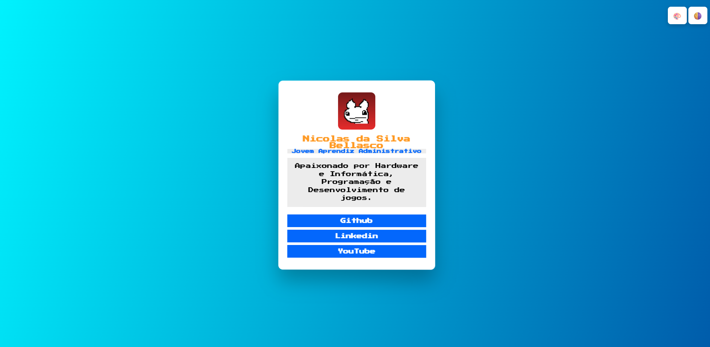

# Cartão Pessoal HTML
#### Cartão Pessoal feito com HTML, CSS e JavaScript por nicolaubanana-dev.

🟡 $$\color{yellow}\text{JavaScript: 74.4}$$%

🟣 $$\color{purple}\text{CSS: 15.4}$$%

🔴 $$\color{red}\text{HTML: 10.2}$$%

## 🔗 Acesse o Projeto

### Clique no link abaixo para ver o site funcionando:
👉 [Visualizar Cartão Pessoal](https://nicolaubanana-dev.github.io/Card-Pessoal-HTML/) 👈

---

**Versão Atual do código: 1.22**

